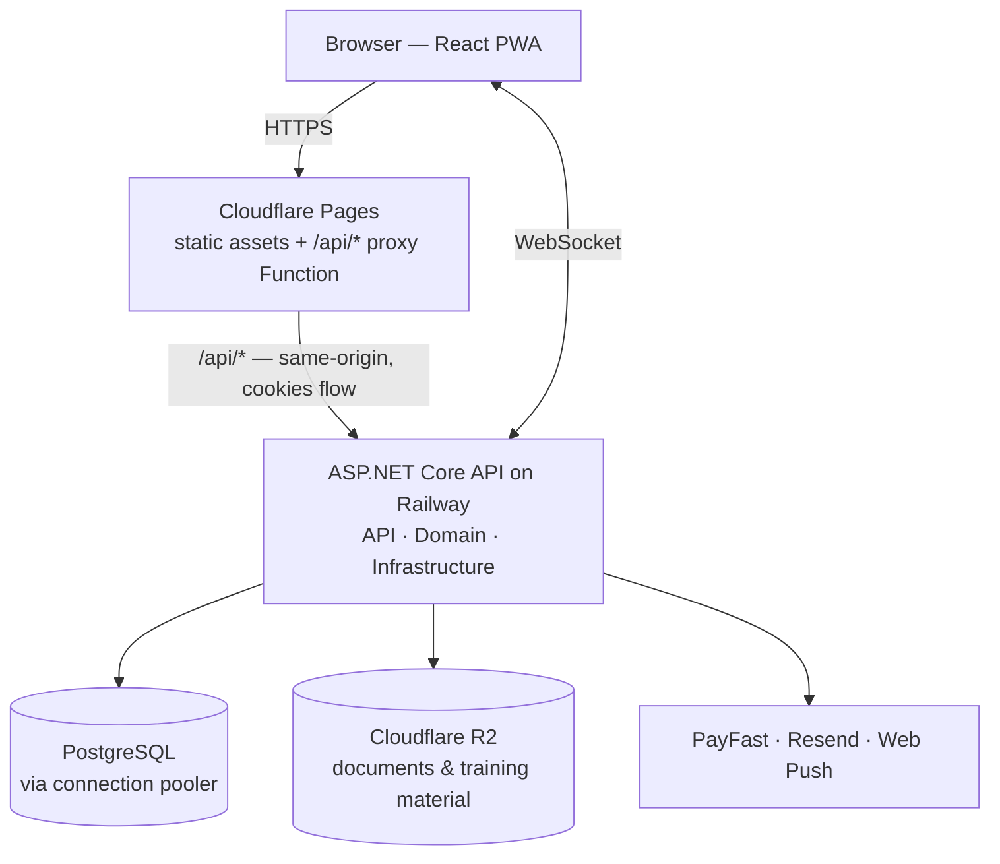

# ClearOps — Case Study

**Live:** [clearops.pages.dev](https://clearops.pages.dev)

A production multi-tenant SaaS platform connecting trained workers with South African SMEs that need accurate, secure back-office data processing. I'm the technical co-founder and sole engineer — I designed the architecture, wrote the code, built the CI/CD pipeline, and run it in production.

> **Why this repo has no source code or screenshots:** ClearOps is a commercial product that processes confidential client documents. The source stays private, and I don't publish interface screenshots because the platform handles third-party business data. This case study documents the architecture and the engineering decisions instead. I'm happy to walk through the running application and the code directly in an interview.

## The problem

South Africa's unemployment crisis isn't a shortage of people willing to work — it's a shortage of verified, remote-capable work that actually reaches them. Meanwhile small businesses across the country carry a permanent backlog of back-office data processing: invoices, records, forms, spreadsheets. It's work they can't justify a full-time hire for, and won't hand to an anonymous freelancer, because the documents are confidential.

ClearOps sits between those two facts. Workers are trained and verified; SMEs submit data-processing work in controlled batches; the platform routes, tracks, and settles it. The business only functions if a small business owner is willing to put a real client invoice in front of someone they've never met — so the entire technical design is built around making that trust reasonable.

- **Trust has to be engineered, not assumed.** The marketplace only works if a business owner will hand confidential documents to a worker they've never met. That's a technical problem before it's a sales problem.

Three constraints shaped every technical decision:

- **Documents are confidential.** Workers process real business documents. The platform has to make careless leakage meaningfully harder than the alternative it replaces.
- **Work is batched and asynchronous.** A business uploads work, workers claim and complete it, and both sides need current state without refreshing.
- **South African market realities.** Local payment rails, mobile-heavy and sometimes patchy connectivity, and cost sensitivity on both sides of the marketplace.

## Stack

**Frontend** — deployed on Cloudflare Pages

| Concern | Choice |
|---|---|
| Framework | React + TypeScript (strict mode), built with Vite |
| Routing & state | React Router · TanStack Query for server state · React Context for auth |
| Forms | React Hook Form with Zod schemas |
| HTTP | Axios with interceptors · **in-memory token store — never localStorage** |
| Styling | Tailwind CSS + per-component CSS over a shared `tokens.css` design system |
| Real-time & offline | SignalR client · PWA via Workbox · Web Push |
| Documents | PDF.js for the in-browser walled viewer |
| Monitoring | Sentry |

**Backend** — containerised, deployed on Railway

| Concern | Choice |
|---|---|
| Framework | ASP.NET Core Web API |
| Architecture | Three-project Clean Architecture — `API` / `Domain` / `Infrastructure` |
| Data | EF Core + Npgsql → Supabase PostgreSQL via the connection pooler |
| Auth | ASP.NET Core Identity + JWT — short-lived access tokens, rotating HttpOnly refresh cookie |
| Real-time | SignalR hubs |
| Object storage | Cloudflare R2 via the S3-compatible SDK |
| Documents | PdfPig for server-side watermarking · ClosedXML for spreadsheet output |
| Integrations | PayFast for payments · Resend for transactional email · VAPID Web Push |
| Operations | Serilog · Sentry · rate limiting · global exception handling |

**Quality:** 53 tests across unit and integration levels — xUnit, Shouldly, NSubstitute, SQLite in-memory, and `WebApplicationFactory`. GitHub Actions runs the suite and handles deployment.

## Architecture

A deliberate monolith. The domain complexity here is in document handling, batch state, and the marketplace's three-sided permissions — not in service topology. Splitting it would add operational overhead without solving a problem I actually have.

## Engineering decisions worth explaining

### Tokens never touch web storage

Access tokens live in a **module-scoped in-memory store** in the React app, not `localStorage` or `sessionStorage`. Anything in web storage is readable by any script that reaches the page, which makes token theft the cheapest possible outcome of an XSS bug. An in-memory token dies with the tab and isn't visible to a script that scrapes storage.

The tradeoff is that a page refresh loses the access token. That's solved with a **rotating refresh token in an HttpOnly cookie**, which JavaScript cannot read at all. Access tokens are short-lived; the refresh token rotates on every use, so a captured refresh token is single-use and its reuse is detectable rather than silent.

This is the decision I'd defend hardest, because it's the one that costs the most in developer convenience and buys the most in blast-radius reduction.

### A same-origin proxy at the edge

HttpOnly refresh cookies are only clean when the API shares an origin with the app. The frontend is on Cloudflare Pages and the API runs on Railway — two different origins, which normally means `SameSite` friction, third-party cookie caveats, and a permissive CORS policy.

Instead, a **Cloudflare Pages Function proxies `/api/*` through to the API**. To the browser, everything is one origin: cookies behave predictably without exceptions, and CORS stays closed rather than being loosened to make auth work.

### Documents are walled, not handed over

Workers need to *read* client documents to process them, but shouldn't accumulate clean copies. Documents live in **Cloudflare R2** and are never served as a direct download to a worker. They're **watermarked server-side with PdfPig** at request time and rendered in-browser through a **PDF.js viewer**.

The watermark carries the requesting worker's identity and the time of access, so any page that leaves the platform traces back to a specific person and session.

This doesn't make exfiltration impossible; a determined person has a phone camera. It removes the casual path — no file sitting in a downloads folder, nothing to forward by accident — which is the realistic threat for this kind of work.

### Live state without polling

Batch status changes, assignments, and notifications push over **SignalR hubs** rather than being polled. Previously both sides had to refresh to find out whether anything had moved. Now a batch changing hands or completing surfaces immediately, which matters most when several workers are drawing from the same pool and nobody should be claiming work that's already gone.

Web Push carries the same events to users who don't have the app open, and the service worker means it installs to a phone home screen — which matters when a meaningful share of workers are mobile-first.

### Pooled database connections

Postgres is reached through a **connection pooler** rather than direct connections. Container platforms cycle instances and open connections aggressively, and Postgres has a hard connection ceiling — the pooler multiplexes them so the API doesn't exhaust the limit during deploys or traffic spikes. It's an unglamorous decision that prevents a whole category of production incident.

### Payments built for the local market

Stripe doesn't serve the South African market the way it serves the US, so payments run through **PayFast**, integrated **server-side via its Instant Transaction Notification webhook** rather than trusting a client-side redirect to tell the backend that money moved.

Every ITN callback is verified with PayFast before it's trusted rather than being taken at face value, and each notification is recorded against its transaction reference — so a redelivered callback settles nothing twice.

## Testing & CI

53 tests, split across two levels:

- **Unit** — domain logic isolated with NSubstitute for collaborators and Shouldly for assertions
- **Integration** — full request/response cycles through `WebApplicationFactory` against SQLite in-memory, so routing, authentication, and EF Core mappings are exercised together rather than mocked past

GitHub Actions runs the suite on every push and handles deployment. The integration tier is the one that earns its keep — most of what has broken in this project has broken at the seams between layers, not inside them.

## Status & roadmap

ClearOps is built, deployed, and running end to end — authentication, document handling, batch workflow, real-time updates, and payments are all implemented rather than stubbed. The current focus is demand validation: proving SME appetite and building the initial verified worker pool before scaling either side of the marketplace.

On the technical roadmap:

- Extending the test suite to cover the document pipeline end to end
- Custom domain and production hardening ahead of onboarding the first cohort at scale

## Discussing this project

I can't share the source, but I'm glad to go deeper in conversation on any of the above — the auth flow, the document pipeline, the Clean Architecture boundaries, or where I'd do it differently next time. A live walkthrough of the running application is available on request.

---

Built by **Jason Davids** — [GitHub](https://github.com/JasonD21) · [LinkedIn](https://www.linkedin.com/in/jason-davids-09aa201b0/)
